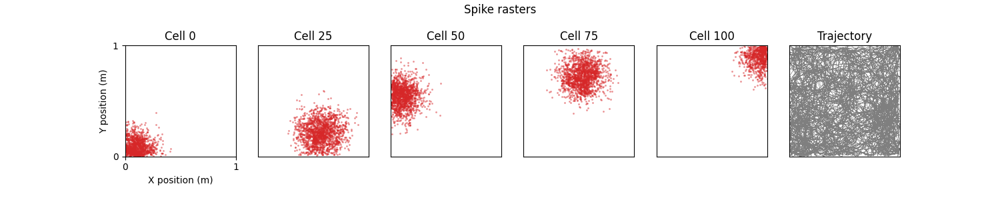
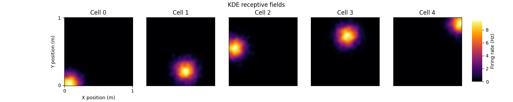
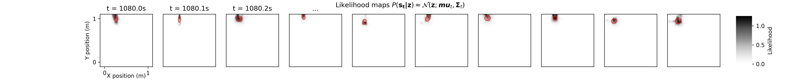
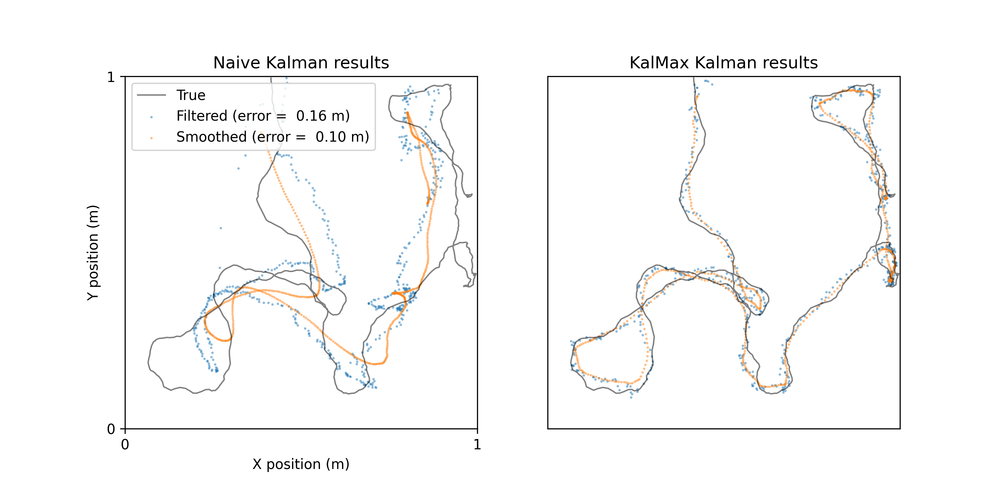

# **KalMax**:  Kalman based neural decoding in Jax
**KalMax** = **Kal**man smoothing of **Max**imum likelihood estimates in Jax.

You provide $\mathbf{S} \in \mathbb{N}^{T \times N}$ (spike counts) and $\mathbf{Z} \in \mathbb{R}^{T \times D}$ (a continuous variable, e.g. position) and this provides jax-optimised functions and classes to:

1. Fit receptive fields for each neuron using Kernel density estimation 
2. Calculate the likelihood of new spike counts given these receptive fields, then approximate these as Gaussians: $P(\mathbf{s}_t|\mathbf{z}) \approx \mathcal{N}(\mathbf{z}; \boldsymbol{\mu}_t, \boldsymbol{\Sigma}_t)$
3. Kalman filter $P(\mathbf{z}_t|\boldsymbol{\mu} _ {1:t})$ and smooth $P(\mathbf{z}_t | \boldsymbol{\mu} _ {1:T})$ these to estimate latent variable on held-out test spikes.

Note this differs from the standard Kalman filter where spikes counts (or perhaps spike rates) are treated as the observations. 

# Install
Clone and navigate to this folder and run 
```
git clone https://github.com/TomGeorge1234/KalMax.git
cd KalMax
pip install -e .
```
(`-e`) is optional for developer install. 

Alternatively 
```
pip install git+https://github.com/TomGeorge1234/KalMax.git
```

# Usage  

A full demo is provided in the [`kalmax_demo.ipynb`](./kalmax_demo.ipynb). Sudo-code is provided below. 

```python
import kalmax 
import jax.numpy as jnp 
```

```python
# 0. PREPARE DATA IN JAX ARRAYS
S_train = jnp.array(...) # (T, N_CELLS)      train spike counts
Z_train = jnp.array(...) # (T, DIMS)         train continuous variable
S_test  = jnp.array(...) # (T_TEST, N_CELLS) test spike counts
bins    = jnp.array(...) # (N_BINS, DIMS)    coordinates at which to estimate receptive fields / likelihoods)
```


```python
# 1. FIT RECEPTIVE FIELDS using kalmax.kde
firing_rate = kalmax.KDE.kde(
    bins = bins,
    trajectory = Z_train,
    spikes = S_train,
    kernel = kalmax.kernels.gaussian_kernel,
    kernel_kwargs = {'covariance':0.01**2*np.eye(DIMS)}, # kernel bandwidth
    ) # --> (N_CELLS, N_BINS)
```



```python
# 2.1 CALCULATE LIKELIHOODS using kalmax.poisson_log_likelihood
log_likelihoods = poisson_log_likelihood(
    spikes = S_test,                       
    mean_rate = firing_rate,
    ) # --> (T_TEST, N_CELLS)

# 2.2 FIT GAUSSIAN TO LIKELIHOODS using kalmax.utils.fit_gaussian
MLE_means, MLE_modes, MLE_covs = kalmax.utils.fit_gaussian_vmap(
    x = bins, 
    likelihoods = jnp.exp(log_likelihoods),
    ) # --> (N_CELLS, DIMS), (N_CELLS, DIMS, DIMS)
```


```python
# 3. KALMAN FILTER / SMOOTH using kalmax.KalmanFilter.KalmanFilter
kalman_filter = KalmanFilter(
    dim_Z = DIMS, 
    dim_Y = N_CELLS,
    # SEE DEMO FOR HOW TO FIT/SET THESE
    F=F, # state transition matrix
    Q=Q, # state noise covariance
    H=H, # observation matrix
    R=None, # observation noise covariance
    ) 

# [FILTER]
mus_f, sigmas_f = kalman_filter.filter(
    Y = Y, 
    mu0 = mu0,
    sigma0 = sigma0,
    ) --> (T, DIMS), (T, DIMS, DIMS)

# [SMOOTH]
mus_s, sigmas_s = kalman_filter.smooth(
    mus_f = mus_f, 
    sigmas_f = sigmas_f,
    ) --> (T, DIMS), (T, DIMS, DIMS)
```

